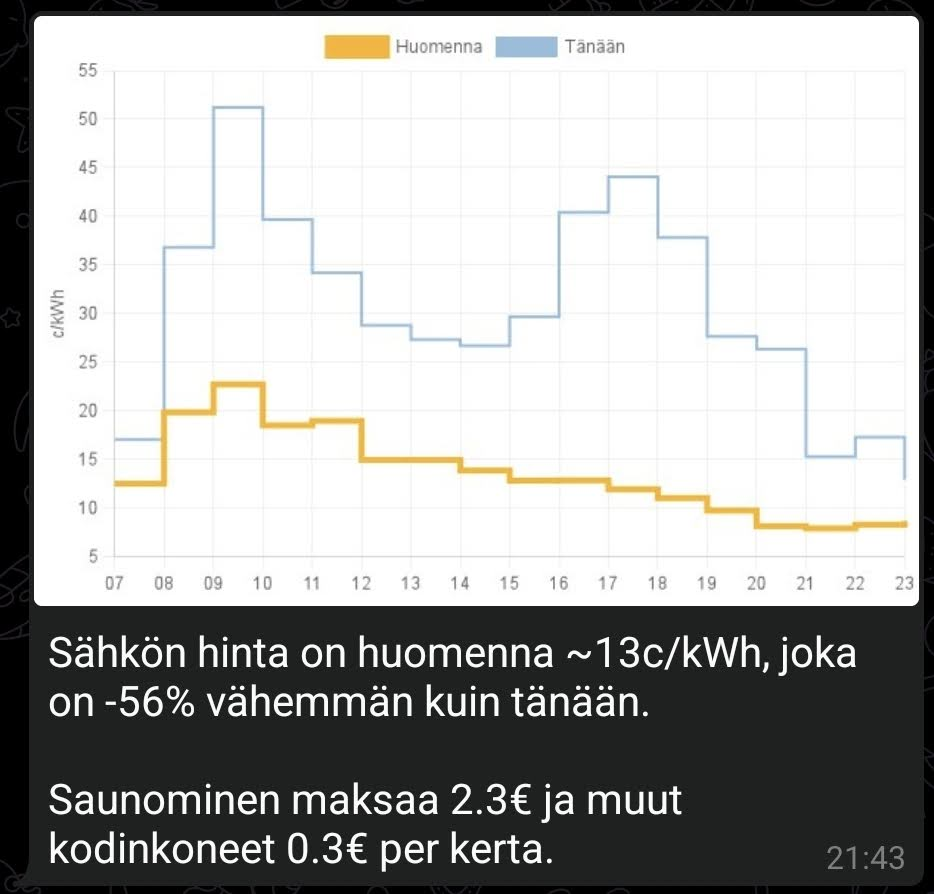

# Elektro-Scrooge

A Telegram bot for monitoring spot prices of electricity. To sauna or not to sauna, that is the question.

The app pulls hourly spot prices for Nord Pool, and divides them into day (07:00-23:59) and night (00:00-06:59) segments.

Daily averages are calculated from the day segment only. Nightly prices are ignored.

The app adds electricity company margin, Finnish VAT, grid transfer fees and electricity tax to the spot prices, so all values shown are total prices per kWh.

## Getting started

    npm install
    npm run build
    npm run start

By default, when run locally, the program will do a dryrun, printing the HTML-formatted content of the messages instead of sending the messages to Telegram.

In order to send messages to Telegram, you'll need to setup a bot and a chat, and either disable the local dryrun, or deploy the program to AWS Lambda.

### Testing

    npm run build
    npm run lint
    npm run test

### Deploying

There's unfortunately quite a lot of manual steps to completely deploy this project:

- Install canvas lambda layer https://github.com/charoitel/lambda-layer-canvas-nodejs
- Setup a Telegram bot with BotFather and get your bot auth token and chat ID
- Setup working AWS CLI credentials
- Download a font that you want to use and include it in the `render.ts`.

#### Using Pulumi (Recommended)

Install Pulumi CLI and configure your stack:

    npm install
    npm run build
    pulumi login  # or pulumi login --local for local state
    pulumi stack init dev  # or your preferred stack name
    pulumi config set aws:region eu-west-1
    pulumi config set --secret telegram_bot_auth_token <your-bot-token>
    pulumi config set --secret telegram_chat_id <your-chat-id>

Deploy:

    pulumi up

To remove all resources:

    pulumi destroy

#### Using Serverless Framework (Legacy)

Make a copy of `secrets.example.yml` into `secrets.yml` and fill in your Telegram credentials:

    npm install serverless
    npm run build
    npm run deploy
